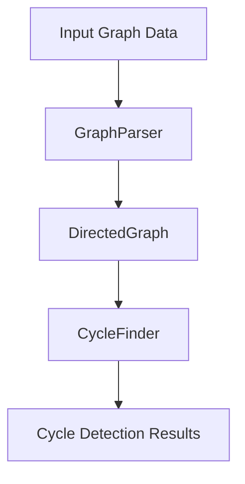
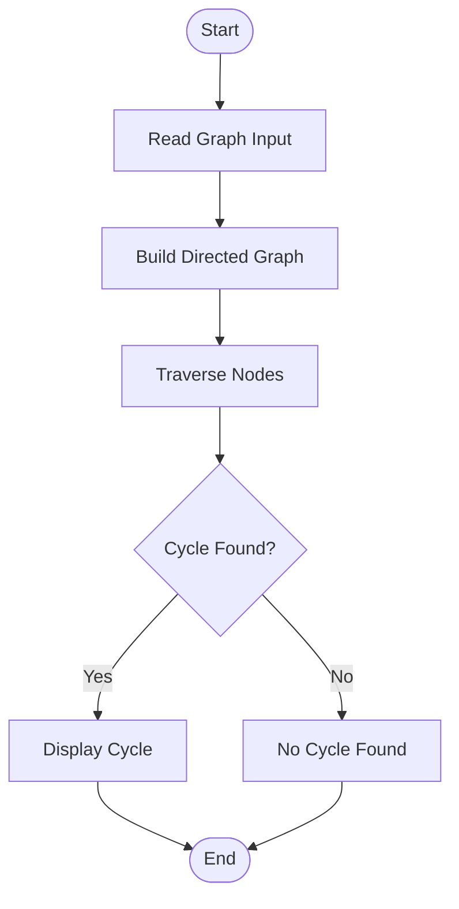

# 🚦 Directed Graph Cycle Detection System

## Overview

This project is a Java-based algorithm implementation that analyzes directed graphs and detects cycles using graph traversal techniques. The system parses graph input data, creates graph structures, and identifies cycles efficiently.

---

## ✨ Features

* Parse graph input data
* Create and manage directed graphs
* Detect cycles in graph structures
* Modular object-oriented design
* Efficient graph traversal algorithms

---

## 🛠 Technologies Used

* Java
* Object-Oriented Programming (OOP)
* Graph Algorithms
* IntelliJ IDEA

---

## 📁 Project Structure

```text
w2120471/
│
├── src/
│   ├── Main.java
│   ├── DirectedGraph.java
│   ├── GraphParser.java
│   └── CycleFinder.java
│
├── out/
├── .gitignore
└── README.md
```

---

## 📊 System Architecture



---

## 🔄 Algorithm Flow



---

## 🧠 Core Components

### Main.java

Controls program execution.

### DirectedGraph.java

Handles graph creation and node relationships.

### GraphParser.java

Reads and processes graph input.

### CycleFinder.java

Implements cycle detection logic.

---
